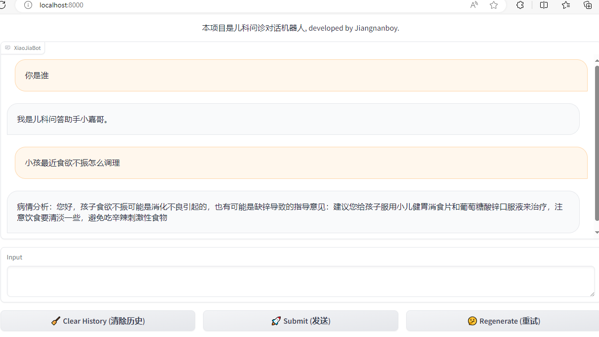

# pediatrics_llm_qa：儿科问诊小模型

## 🌐项目简介

本项目开源了基于儿科医疗指令微调的问诊模型：**pediatrics_llm_qa**，目前模型的主要功能如下：

<!DOCTYPE html>
<html>
<body>
<table style="width: 100%;">
  <tr style="border-collapse: collapse; border: transparent;">
      <td style="width: 50%; border-collapse: collapse;border: transparent;"><div align="center"><strong>智能问诊</strong>：问诊后给出诊断结果和建议。</div></td>
  </tr>
</table>
</body>
</html>

## 💫更新
* [2024/09/11] 开源了基于Qwen2-1.5B-instruct lora指令微调的儿科问诊模型

##  🔬开源模型

<!DOCTYPE html>
<html>
<head>
</head>
<body>
<table style="width: 80%;">
  <tr>
      <td style="width: 20%;"><div align="center"><strong>模型</strong></div></td>
      <td style="width: 20%;"><div align="center"><strong>基座</strong></div></td>
      <td style="width: 30%;"><div align="center"><strong>HuggingFace</strong></div></td>
  </tr>
  
  <tr>
      <td><center>pediatrics_llm_qa_1.5B</center></td>
      <td><center><a href="https://huggingface.co/Qwen/Qwen2-1.5B-Instruct">Qwen2-1.5B-instruct</a></center></td>
      <td><center>🤗<a href="https://huggingface.co/jiangnanboy/pediatrics_llm_qa">pediatrics_llm_qa_1.5B</a></center></td>
  </tr>
</table>
</body>
</html>


## ⚡快速开始

1. 配置环境（测试环境如下，具体版本可以根据实际需求配置）

   * openvino
   * openvino-tokenizers
   * optimum-intel>=1.17.0
   * transformers>=4.40.0,<4.42.0
   * huggingface-hub>=0.21.3
   * torch>=2.1
   * gradio>=4.20.0
   * peft
   * pandas

2. 训练及合并
   ```bash
   1.训练代码见train_sft/train.py，儿科问答训练语料见data_process/all_data.rar
   
   2.此模型是经微调后的lora模型，需要将其与Qwen2-1.5B-Instruct模型进行merge，merge代码见：
   train_sft/merge_lora_weights.py
   ```

3. 下载模型参数并运行（要求单卡GPU >= 15G或者CPU）
   ```bash
   GPU环境请运行gpu_infer下面的流式推理：
        1.gpu_stream_infer.py
        2.web形式的运行gpu_web_demo.py
   
   CPU环境请运行cpu_infer下面的流式推理：(对merge后的模型转换为支持CPU运行格式，转换见cpu_infer/convert.py，转换命令为【python convert.py --model_id /output_qwen_merged --precision fp16 --output /output_qwen_merged-ov】)
        1.cpu_stream_infer.py
        2.web形式的运行cpu_web_demo.py
   ```
   
## web样例

<p align="center">
  
</p>

## 免责声明

预训练模型是基于大量语料库和算法模型进行训练的，并且在训练过程中可能存在偏差、错误和不完整的信息。因此，本项目提供的预训练模型仅供参考和研究使用，并不能保证其准确性和可靠性。使用预训练模型产生的结果可能存在误差和偏差，不能用于实际应用或决策。本项目不对使用预训练模型所产生的结果承担任何责任，也不对因使用预训练模型所产生的任何损失承担责任。使用者在使用预训练模型时应自行承担风险并进行自我验证。


## 引用

如果你使用了本项目代码，请声明引用

```latex
@article{
  title={https://github.com/jiangnanboy/pediatrics_llm_qa},
  author={jiangnanboy},
  year={2024}
}
```
